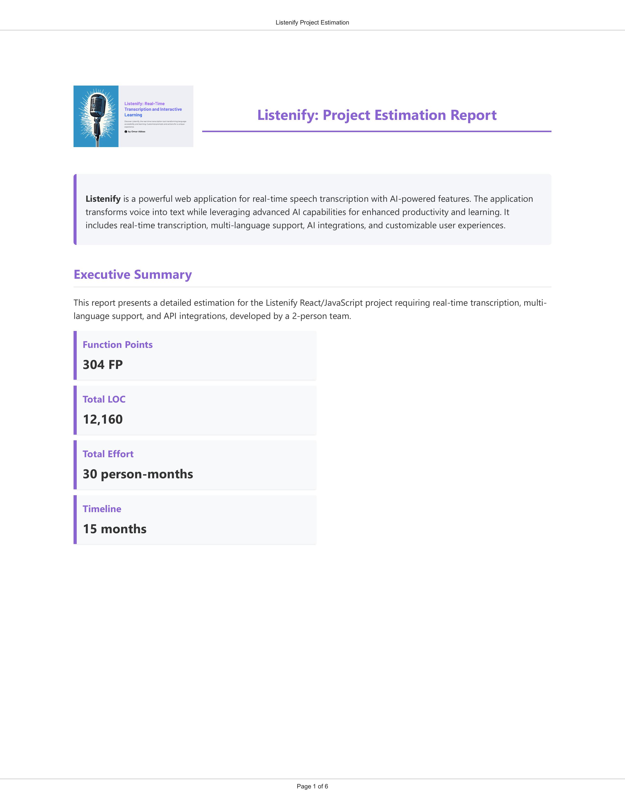
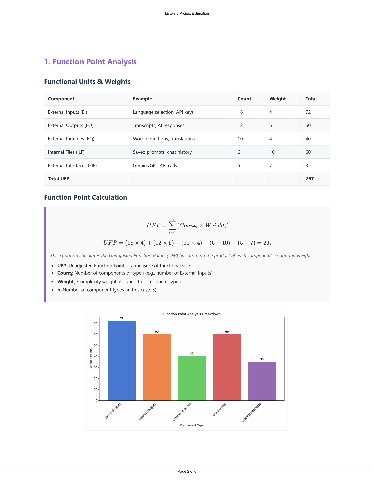
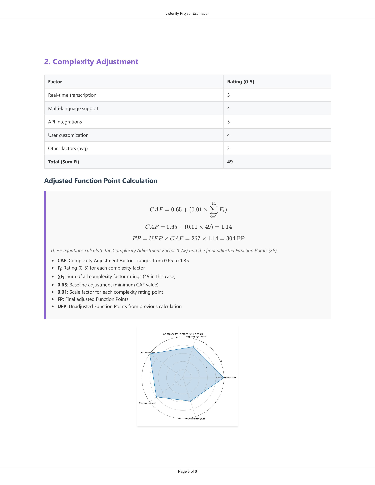
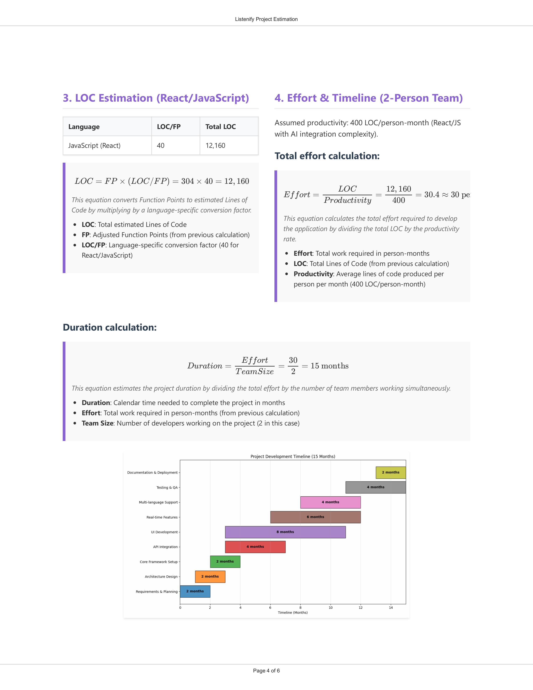
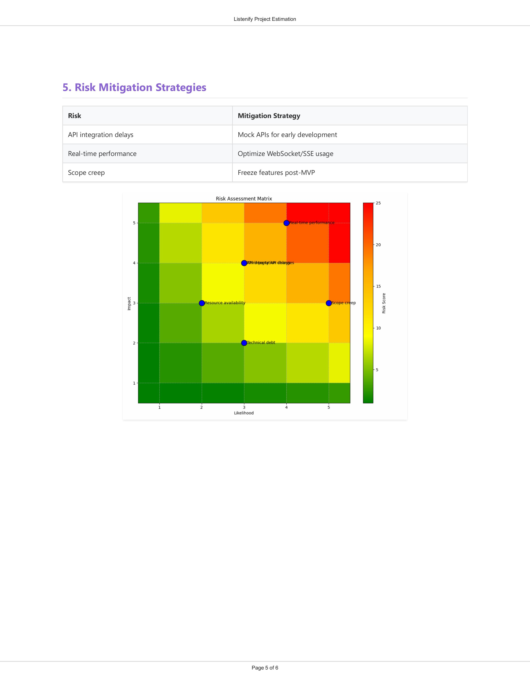
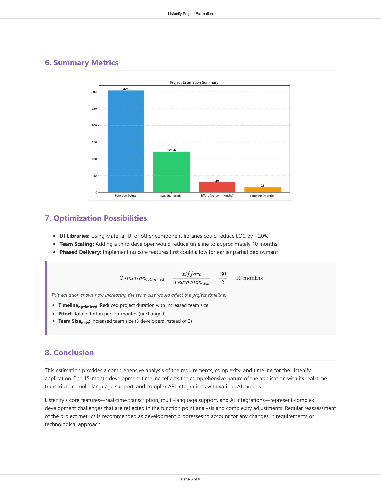

# Listenify Project Estimation Report Generator

This repository contains a professional project estimation report for the Listenify application - a React/JavaScript project for real-time speech transcription with AI-powered features.

## Project Structure

```
├── assets/                      # Directory containing all images
│   ├── complexity_factors.png   # Complexity factors visualization
│   ├── function_point_breakdown.png # Function point breakdown chart
│   ├── project_timeline.png     # Project timeline visualization
│   ├── risk_matrix.png          # Risk assessment matrix
│   ├── summary_metrics.png      # Summary metrics visualization
│   └── thumbnail.png            # Project logo
├── project_report_enhanced.html # Enhanced HTML report with MathJax support
├── generate_pdf_with_mathjax.js # Node.js script to convert HTML to PDF
├── generate_professional_pdf.bat # Batch file to run the PDF generation
├── project_estimation.py        # Python script to generate report data & charts
├── listenify_project_estimation_professional.pdf # Generated PDF report
├── package.json                 # Node.js dependencies
├── package-lock.json            # Dependency lock file
└── requirements.txt             # Python dependencies
```

## Project Visualizations

| Image | Description |
|-------|-------------|
|  | Project overview and executive summary visualization |
|  | Detailed function point analysis breakdown |
|  | Project complexity factors and metrics |
|  | Project timeline and milestone projections |
|  | Risk assessment matrix and mitigation strategies |
|  | Project metrics and KPI summary dashboard |

## Features

- Comprehensive function point analysis
- Complexity adjustment calculations 
- Lines of code (LOC) estimation
- Effort and timeline projections
- Risk assessment visualization
- Project timeline visualization
- Summary metrics with visualizations
- Professional PDF generation with MathJax equation rendering

## Prerequisites

### For Python Charts Generation:
```
pip install -r requirements.txt
```

### For PDF Generation:
```
npm install
```

## Usage

### To regenerate the charts:
```
python project_estimation.py
```

### To generate the PDF from HTML:
```
node generate_pdf_with_mathjax.js
```
Or run the batch file:
```
.\generate_professional_pdf.bat
```

## Report Contents

- Executive Summary
- Function Point Analysis
- Complexity Adjustment
- LOC Estimation
- Effort & Timeline
- Risk Mitigation Strategies
- Summary Metrics
- Optimization Possibilities
- Conclusion 

> ASSISTED BY AI - OMAR ABBAS 